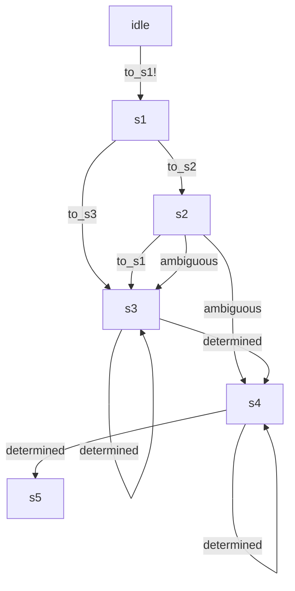

# Finitomata Compiler

_Elixir_ provides an ability to introduce a custom [compiler](https://hexdocs.pm/mix/Mix.Task.Compiler.html) for any `mix` project. `Finitomata` leverages this feature, providing a set of [diagnostics](https://hexdocs.pm/mix/Mix.Task.Compiler.Diagnostic.html) for modules declaring the _FSM_.

## Overview

Consider the following _FSM_.



Here we have transitions which do not require a handler (events `to_s1!`, `to_s1`, `to_s2`, and `to_s3` define the target state, so just sending the event to the _FSM_ in the respective state would be enough.) Also we have `ambiguous` and `determined` events (don’t ask about the name of the latter,) which wouldn’t succeed without the respective `c:Finitomata.on_transition/4` handler declared. This handler must route the event to one of two possible states, conditionally returning `{:ok, :s3, state}` or `{:ok, :s4, state}` based on the state, the payload, or the event payload.

An attempt to call `ambiguous` event from state `s2` without this handler defined would result in runtime error of the shape

```elixir
{:error, {:ambiguous_transition, {:s2, :ambiguous}, [:s3. :s4]}}
```

but we can do better. Here is the custom compiler shining. Let’s see how the editor would have the code highlighted.


## Warnings, Infos, Hints

There are three different types of diagnostics provided by `:finitomata` compiler.

### Warning

Warning is reported both to the language server _and_ to console during project compilation. It says “this module declares some ambiguous transitions not handled in the code.” Here is how it looks in the editor.


### Info

Info is reported in cases when the compiler is not able to determine whether the ambiguous transition has been covered or not.


### Hint

Hint is emitted when the compiler is positive about the ambiguous transition has been covered, just for the sake of better user experience.


## WIP

This compiler is very much _WIP_, but it’s already fully functional, and, despite it is not able yet to report complicated cases when the transition seems to be handled, but one or more branches are unreachable, it could be a very handy tool for the additional self-check on whether the _FSM_ is covered or the application might suffer the _ambiguous_, or _not reachable_, or _not allowed_ runtime errors.


