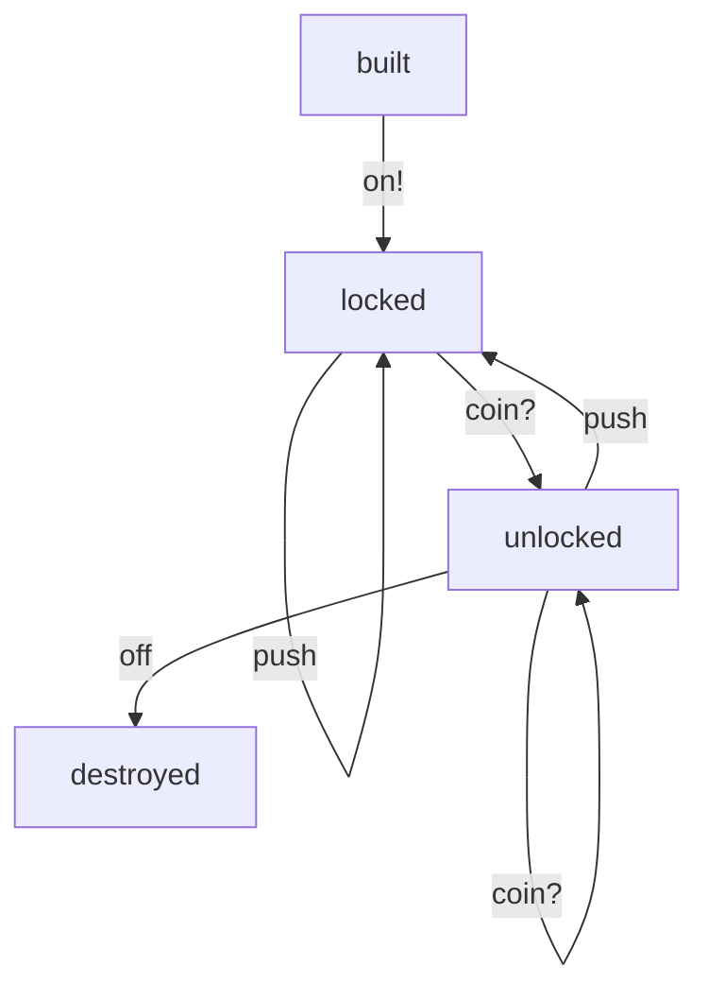

# Finite Automata

## Above and Beyound

> If you have issues fully understanding Finite Automata aka _FSM_, here is a one-sentence explanation that might clarify everything.
>
> _FSM_ consists of states, transitions, and events, where the state is an adjective (or noun,) the event is a verb and the transition is an adverbial participle.

This definition, while being mathematically lax, shallow, cursory, and maybe even perfunctory, reveals the whole and allows to grasp the very core thing about _FSM_ nature: it describes a life in the same way the human language desribes it.

## Yet Another Library

I’m a big fan of [Finite Automata](https://en.wikipedia.org/wiki/Finite-state_machine). Always have been. Whenever we deal with a long-lived objects, they eventually have states and _FSM_ does an enormously great job by attesting consistency, eliminating human errors and leaving the implementation with a business logic only. In a mediocre project, fifty `if`-`then`-`else` conditionals might perform as well as one _FSM_, but unless you are paid for the number of LoCs, _FSM_ is drastically easier to carry on.

## Internals

This library leverages the power of _callbacks_ to not only completely cover the _FSM_ implementation, but also provide a compile-time proof the _FSM_ is valid and functional. One of the most important things this library provides is the _FSM_ description itself, that is fault-tolerant, not error-prone, and easy to grasp. The _FSM_ definition, which is currently supported in both [PlantUML](https://plantuml.com/en/state-diagram) and [Mermaid](https://mermaid.live) syntaxes, would be drawn in the generated docs of the project using this library.

The consumer of this library initiates a transition by calling somewhat like `transition(object, event)`, then the `GenServer` does its magic and the callback `on_transition/4` gets called. From inside this callback, the consumer implements the business logic and returns the result (the next state to move the _FSM_ to.) There are also syntactic sugar callbacks `on_enter/2`, `on_exit/2`, `on_failure/3`, and `on_terminate/1` to allow easy state change reactions, handling of errors, and a final cleanup respectively.

All the callbacks do have a default implementation, which would perfectly handle transitions having a single to state and not requiring any additional business logic attached. When needed, this might be turned off.

Upon start, _FSM_ moves to its _initial state_ and sits there awaiting for the transition request. Upon this request, it’d call `on_transition/4` callback and either move to the next state, or remain in the current one, according to the response from the callback. Upon reaching a final state, it would terminate itself, that’s where `on_terminate/1` callback is called from. The process also keeps all the history of states it went through, and might have a payload in its state.

## Cool stuff

This library has a compilation-time guarantee the _FSM_ is valid, e. g. has the only one begin state, has at least one end state, all states can be reached, _and_ all the necessary callbacks are defined. That said, if we an _FSM_ has an event initiating transitions from the same state to two different states, and there is no `on_transition/4` clause covering that case, the compile-time error would be raised. On the other hand, if the transition is predetermined and might lead to the only one state, the callback implementation is not mandatory, because there is no trolley problem between these two states.

The _FSM_ definition allows event names, terminated with bangs and/or question marks. If the event name is terminated with a bang (`init!`,) **and this event is the only one possible from this state,** the event will be called automatically once _FSM_ enters this state. This is handy for moving through initialization or through states which do not require a consumer intervention and might be done immediately after _FSM_ reaches the respective state. If the transition failed in any way (the state has not been left either due to `{:error, any()}` response received from `on_transition/4` _or_ due to other unexpected issue, like if `on_transition/4` raised,) the `on_failure/3` callback would be called and the warning would be printed to the log. To suppress this behaviour and to allow a transition silently fail, the event should have ended with a question mark  (`try_call?`.) The event cannot have both a bang and a question mark in its name.

## Wiki Example

Wikipedia provides a [turnstile as an example](https://commons.wikimedia.org/wiki/File:Turnstile_state_machine_colored.svg#/media/File:Turnstile_state_machine_colored.svg) of _FSM_.


Below is the `Finitomata` take on this _FSM_.

```elixir
defmodule Turnstile do
  @fsm """
  built --> |on!| locked
  locked --> |push| locked
  locked --> |coin?| unlocked
  unlocked --> |push| locked
  unlocked --> |coin?| unlocked
  unlocked --> |off| destroyed
  """

  use Finitomata, @fsm, auto_terminate: true

  def on_transition(state, :push, _event_payload, state_payload) do
    if state == :locked, do: electrocute!()
    {:ok, :locked, state_payload}
  end

  def on_transition(:locked, :coin?, _event_payload, state_payload) do
    {:ok, :unlocked, state_payload}
  end

  def on_transition(:unlocked, :coin, _event_payload, state_payload) do
    Logger.info("Thanks, this coin will be donated to the animal shelter!")
    {:error, :unexpected_coin}
  end

  def on_transition(_, :off, _, state_payload),
    do: {:ok, :destroyed, state_payload}

  # def on_failure(…), do: …

  # def on_terminate(…), do: …
end
```

The docs for this module would have the following diagram contained (see the `ex_doc` for how to enable _Mermaid_.)


